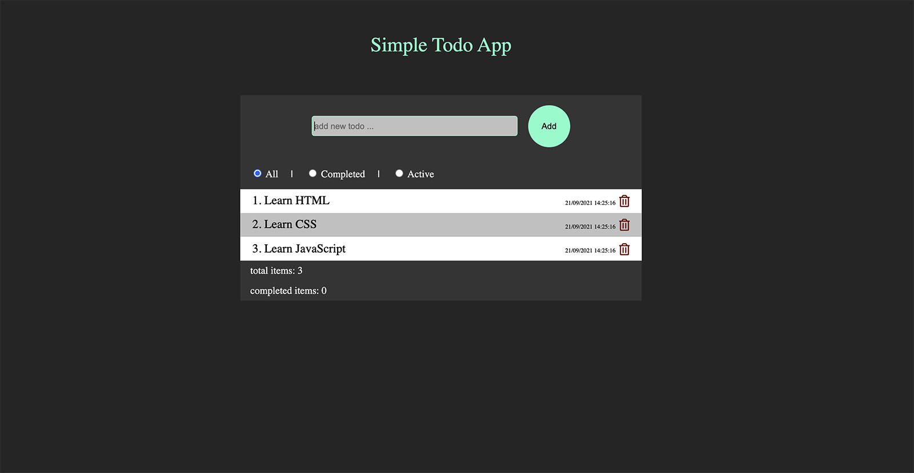

# Project from front-end Advanced course

Simple REST App, build with localStorage and localhost.  
LocalStorage: todoApp-locoalstorage.js  
LocalHost: todoApp.js

## Links

- Live Site URL:  
[http://drumbi.eu/02-AdvancedCourse/03_TODOApp-new/](http://drumbi.eu/02-AdvancedCourse/03_TODOApp-new/)  

## Built with

- HTML
- CSS / SASS
- JAVASCRIPT

## Screenshot

