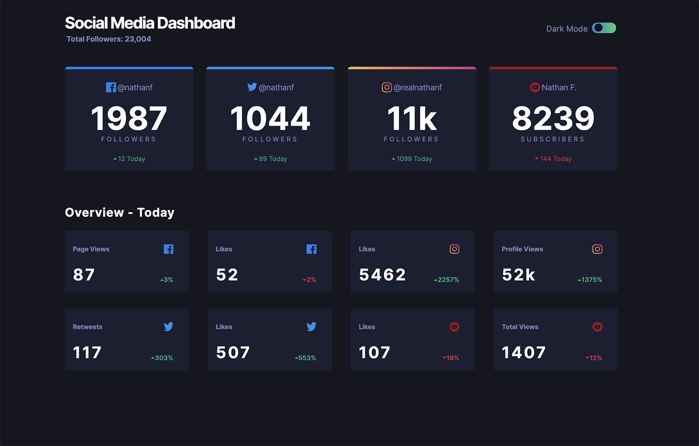

# Frontend Mentor - Social media dashboard with theme switcher solution

This is a solution to the [Social media dashboard with theme switcher challenge on Frontend Mentor](https://www.frontendmentor.io/challenges/social-media-dashboard-with-theme-switcher-6oY8ozp_H). Frontend Mentor challenges help you improve your coding skills by building realistic projects. 

## Table of contents

- [Overview](#overview)
  - [The challenge](#the-challenge)
  - [Links](#links)
- [My process](#my-process)
  - [Built with](#built-with)
- [Screenshot](#screenshot)

## Overview

### The challenge

Users should be able to:

- View the optimal layout for the site depending on their device's screen size
- See hover states for all interactive elements on the page
- Toggle color theme to their preferencers

### Links

- Live Site URL: [http://drumbi.eu/03-FrontendMentor/06-social-media-dashboard-with-theme-switcher-master/](http://drumbi.eu/03-FrontendMentor/06-social-media-dashboard-with-theme-switcher-master/)

## My process

### Built with

- Flexbox
- Mobile-first workflow
- Javascript

## Screenshot

