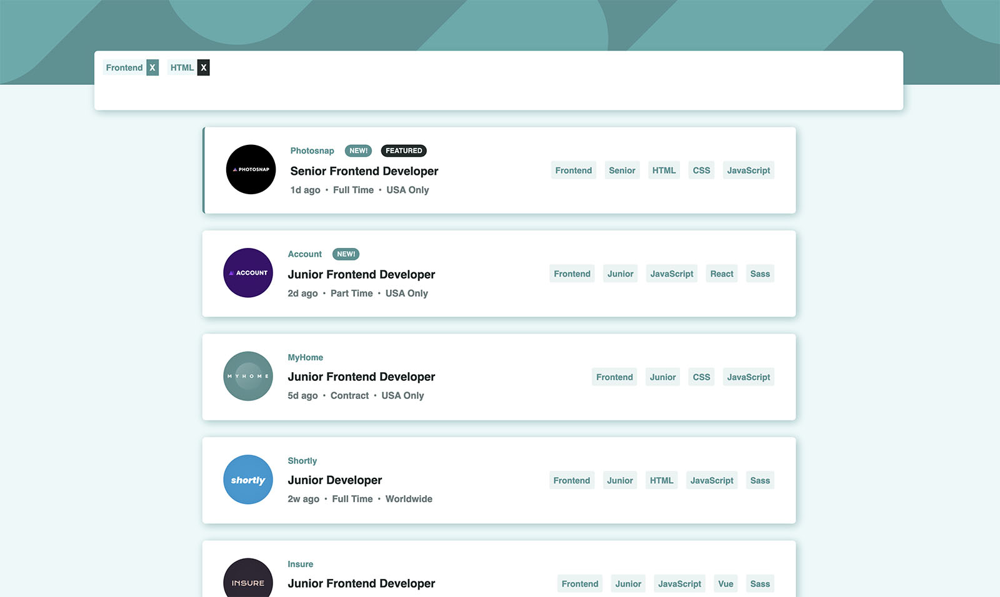

# Frontend Mentor - Job listings with filtering solution

This is a solution to the [Job listings with filtering challenge on Frontend Mentor](https://www.frontendmentor.io/challenges/job-listings-with-filtering-ivstIPCt). Frontend Mentor challenges help you improve your coding skills by building realistic projects. 

## Table of contents

- [Overview](#overview)
  - [The challenge](#the-challenge)
  - [Links](#links)
- [My process](#my-process)
  - [Built with](#built-with)
- [Screenshot](#screenshot)

## Overview

### The challenge

Users should be able to:

- View the optimal layout for the site depending on their device's screen size
- See hover states for all interactive elements on the page
- Filter job listings based on the categories

### Links

- Live Site URL: [http://drumbi.eu/03-FrontendMentor/08-static-job-listings-master/](http://drumbi.eu/03-FrontendMentor/08-static-job-listings-master/)

## My process

### Built with

- Flexbox
- Desktop-first workflow
- Javascript

## Screenshot

