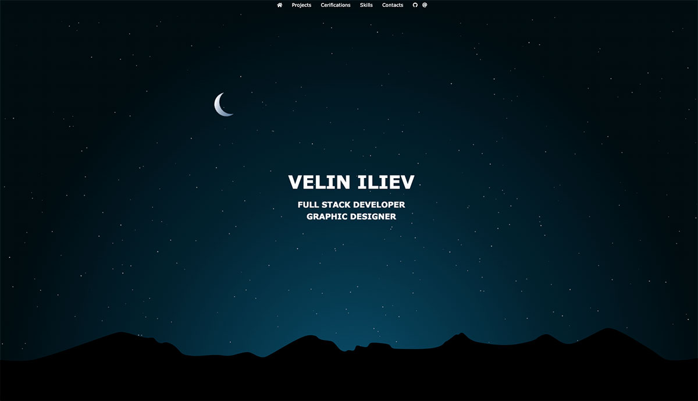

# My current site

build for representation of my skills till now.  
Used VanillaJS, canvas, virtualDOM naipulation, transitions, animation on scroll, functional programming, arrow syntax, ternary operators, fetch and more.

## Links

- Live Site URL: [http://drumbi.eu/](http://drumbi.eu/)  

## Built with

- HTML5
- CSS / FLEX
- JAVASCRIPT ES6+

## Screenshot

